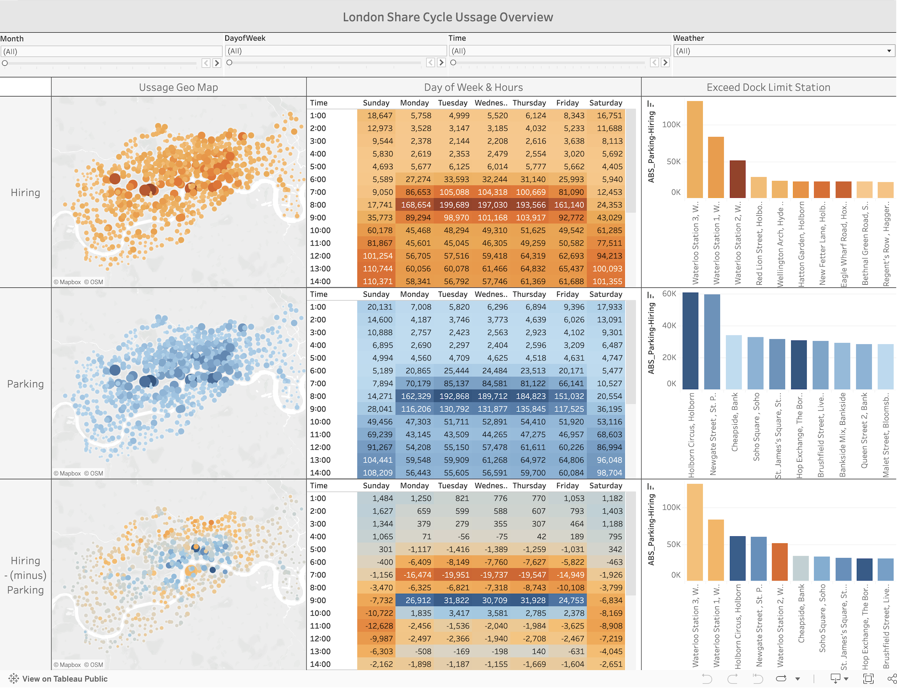
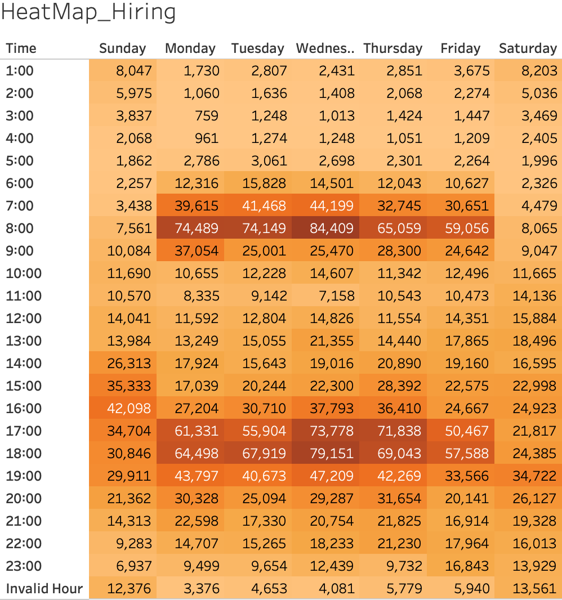
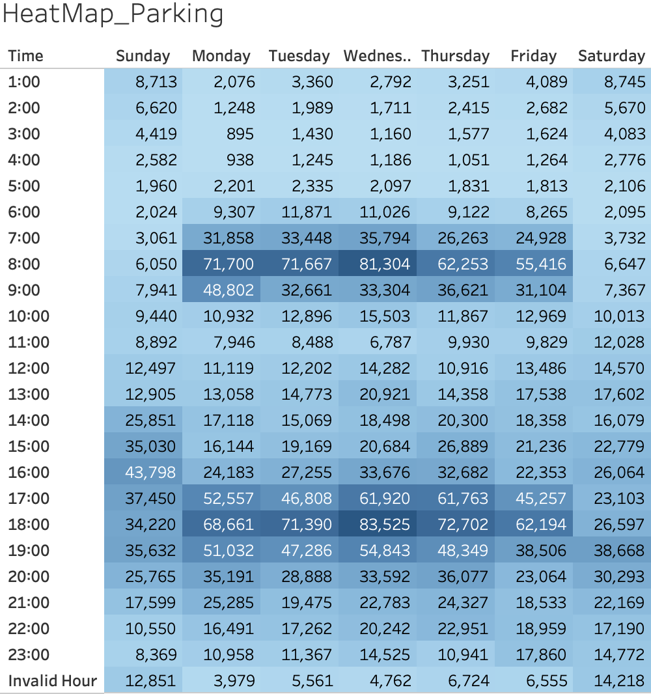
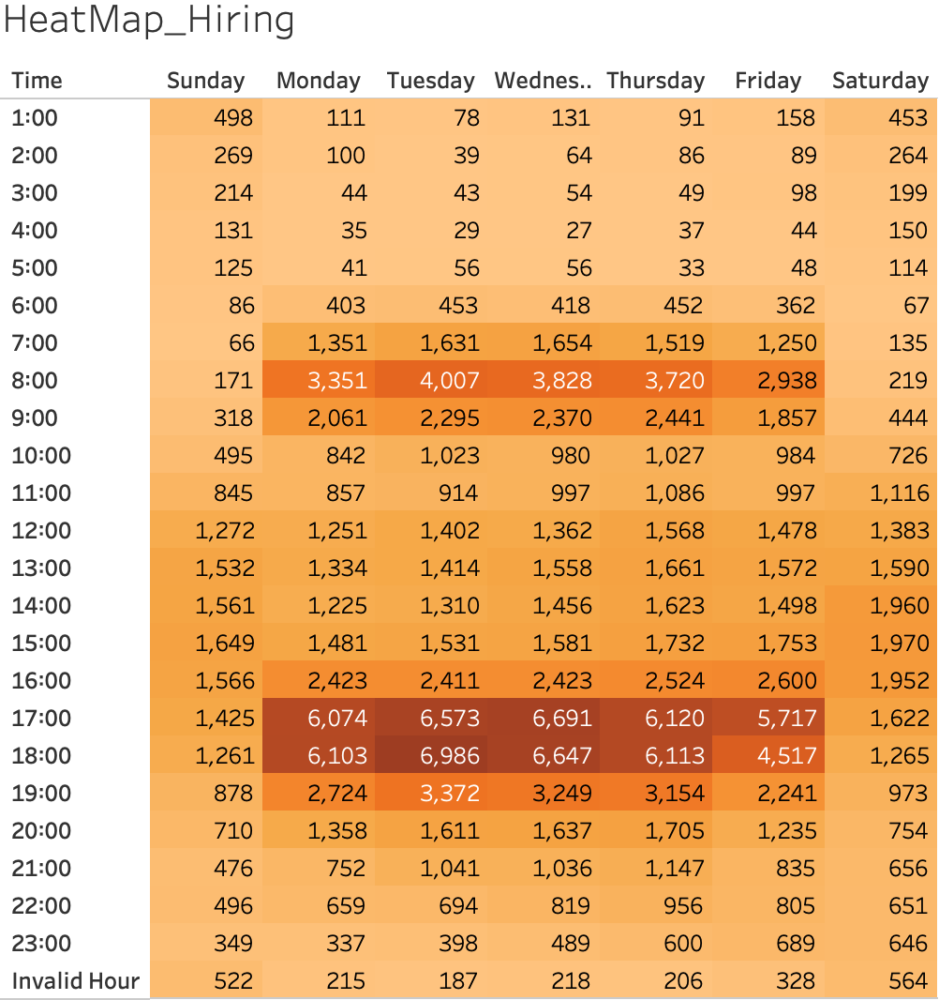

# Santander Cycles Usage Analysis with Docking Station and Weather Data in London (2015 - 2023)

Share cycle usage analysis using [Santander Cycles hires data](https://console.cloud.google.com/marketplace/product/greater-london-authority/london-bicycles?hl=en-GB&inv=1&invt=Abh_CA&project=firm-solution-441714-r2) by Greater London Authority, [docking station data](https://data.london.gov.uk/dataset/cycle-hire-availability) by Transport for London, and [weather data](https://www.kaggle.com/datasets/hmavrodiev/london-bike-sharing-dataset) in kaggle. This project mostly focus on usage analysis in 2016 to connect three different datasets of which periods are also different. Interactive Tableau dashboard for usage overview in 2016 can be found [here](https://public.tableau.com/app/profile/naoki.kojima/viz/london_cycle/Dashboard1?publish=yes).

# Project Background
Aming to optimize operation for share cycle in London, this project analyzes the usage data of Santander Cycles, connecting with dock station and weather data, to uncover ussage patterns and critical insights that will help operation team in Santander Cycles.

Insights and recommendations are provided on the following key areas.
- Monthly, weekly, daily, and hourly ussesage pattern. 
- Geological ussage overview in 789 dock stations for both hiring and parking bikes.
- Usage pattern in seven different weather conditions.
- Dock stations of which is lack of both available bike hirings and available parking docks.

Using large volumn datasets with total column of 83M, most of data expolring, cleaning, preparation and analysis were done in BigQuery environment using SQL query. Only selected data and tables were imported in Tableau for visualization. 

An interactive Tableau dashboard can be downloaded [here](https://public.tableau.com/app/profile/naoki.kojima/viz/london_cycle/Dashboard1?publish=yes).  

# North Star Metrics and Dimensions
Customer Behaviour: Hiring, Parking  
Parking - Hiring: Number of gap between Parking and Hiring calculating by plus for Parking and minus for Hiring  
Time: Yearly, Montly, Weekly, Daily, Hourly  
Location: 789 dock stations in the city of London  
Exceed Dock Limit: Absolute number of "Parking - Hiring" exeeds total docks in stations meaning not available for eitehr parking bikes or hiring bikes. Showing plus in means Parking exceeds Hiring, and minus means Hiring exceeds Parking.  

# Data Structure
The database structure as seen below consists of three tables; Bike, Station, and Weather with a total row count of 83M. 

Most of data prepation and analysis were conducted in BigQuery using SQL query.  
The SQL queries utilized to clean, organize, and prepare data for the dashboard can be found [here](./london_cycle_analysis.sql).

# Executive Summary
Since 2015, the number of bike hires has shown a slight increase over three years, with a year-over-year (YoY) growth rate of 102%. However, this was followed by two consecutive years of YoY declines at -1%. The highest number of hires was recorded in 2022 (11M).  

Bike hires occur throughout the year, but their frequency is positively correlated with temperature rises and negatively correlated with temperature drops. As a result, the peak hiring period is during the summer, while winter sees a decline in hires.  
On weekdays, peak hiring and parking times align with commuting hours — morning arrivals at work and evening returns home. In the morning, bikes are predominantly hired in Zones 1 and 2 and parked in central London, particularly between 7:00 AM and 8:00 AM. Conversely, in the evening, bikes are hired in central London (City of London, Westminster, and Kensington) and parked back in Zones 1 and 2.  

Regarding bike and dock station availability, six locations experienced fully occupied dock stations with no available parking over 100 times in 2016. Similarly, three locations faced a lack of available bikes over 100 times. These "no availability" issues were concentrated in specific dock stations, indicating that addressing these locations would significantly improve operational efficiency.  

[Here](https://public.tableau.com/app/profile/naoki.kojima/viz/london_cycle/Dashboard1?publish=yes) is the usage overview page from Tableau dashboard.  
[Here](https://public.tableau.com/app/profile/naoki.kojima/viz/exceed_dock/Dashboard1?publish=yes) is the map and list of stations exceeding hiring and parking limits from Tableau dashboard. 

  

  

# Summary of Insights
## 1. Lack of Bikes: Morning High Volumn of Hiring Exceeding Evening Parking Cause Lack of Bikes in Waterloo Station.
- The three dock stations in Waterloo Station are the top locations where number of hiring exceed parking. What happening here is low hiring and high parking in the morning, on the other hand, high hiring and low parking in the evening as the chart bewlow shows. However the real problem is high volumn of hiring in the evening exceed that of parking in the morning.
- It is assumed that most of users in the morning are commuter from Waterloo Station and going to workplace in the City of London. It might be almost same users who park in the three dock stations.
- When they go to office from Waterloo Station they can use bikes down to the last one in each three dock stations, but when they return from office to Waterloo Station, they uncure if the three dock stations are available for parking. (It might happen in some cases when they go office as the second insights shown below, however their offices are separately located, so it's not case for all commuters.) This might make some of them hesitate to use the share cycle when they return to Waterloo Station.
- High volumn of hiring in the morning, which exceed number of parking in the evening, could cause lack of available bikes in the morning.

   |            | Hiring     | Parking    |
   |------------|------------|------------|
   | Morning    | high       | low        |
   | Evening    | low        | high       |

## 2. Lack of Docks: Morning High Volumn of Parking Exceeding Evening Hiring Cause Lack of Docks in the City of London.
- The top dock staions where number of parking exceed that of hiring locate in the City of London. A lot of people come from suburb in the morning and return in the evening, so number of parking is high in the morning and that of hiring in the evening is also high.
- As shown the first insight, the real problem is number of parking in the morning is higher than that of hiring in the evening. There might be several reason, for instance, they might go dring with co-workers or as shown the first insight they are unsure to sesure available dock stations near stations.
- Because of these conditions, dock stations can be full with parked bikes and not available additional parking.

   |            | Hiring     | Parking    |
   |------------|------------|------------|
   | Morning    | low        | high       |
   | Evening    | high       | low        |

# Recommendations & Next Steps
## 1. Lack of Bikes:
- Discount for parking bikes in the Waterloo Station in the morning and hiring in the evening to encounrage commuters from city to suburb to use the share cycle.

   |            | Hiring     | Parking    |
   |------------|------------|------------|
   | Morning    |            | Discount   |
   | Evening    | Discount   |            |

## 2. Lack of Dock Stations:
- Discount for hiring bikes in the City of London in the evening to increase number of available docks for the next morning.
- Expand dock stations in the City of London to secure available docks for commuters in the morning.

   |            | Hiring     | Parking    |
   |------------|------------|------------|
   | Morning    |            |            |
   | Evening    | Discount   |            |

