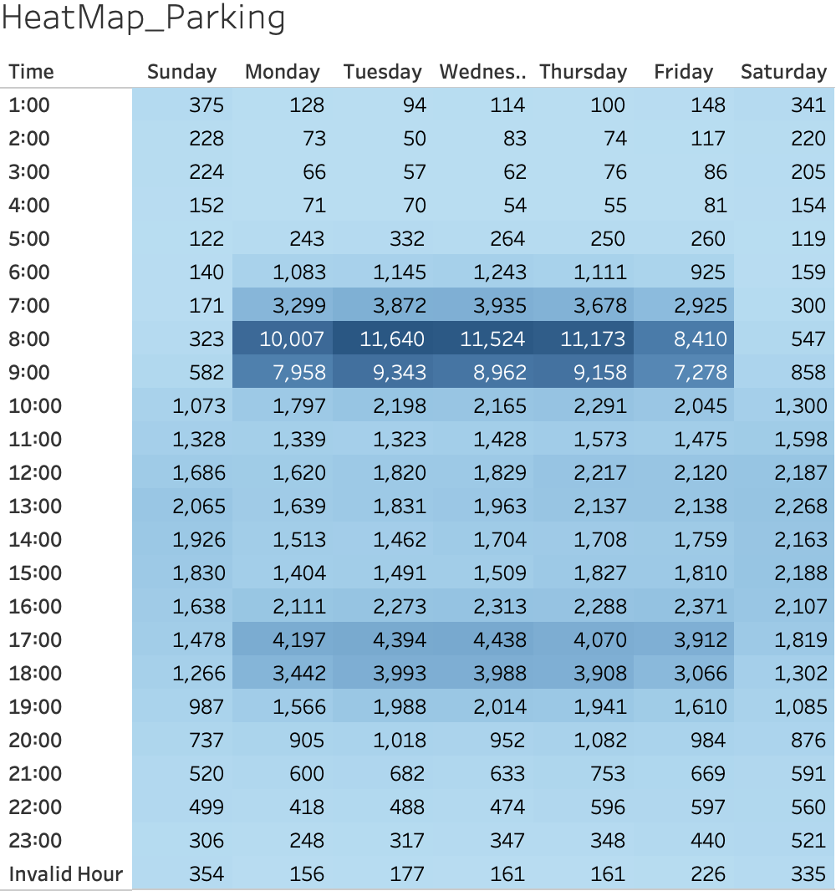

# Santander Cycles Usage Analysis with Docking Station and Weather Data in London (2015 - 2023)

Analysis of share cycle usage to uncover patterns in bike usage and unavailability of bikes and docking stations. The study uses [Santander Cycles hires data](https://console.cloud.google.com/marketplace/product/greater-london-authority/london-bicycles?hl=en-GB&inv=1&invt=Abh_CA&project=firm-solution-441714-r2) (2015–2023) provided by the Greater London Authority, [docking station data](https://data.london.gov.uk/dataset/cycle-hire-availability) by Transport for London, and [weather data](https://www.kaggle.com/datasets/hmavrodiev/london-bike-sharing-dataset) from Kaggle. The project primarily focuses on 2016, integrating three datasets with differing periods.  
  
An interactive Tableau dashboard for the 2016 analysis is available [here](https://public.tableau.com/app/profile/naoki.kojima/viz/london_cycle/Dashboard1?publish=yes).

---

## Project Background

This project aims to improve the availability of bikes and docking stations and optimize the logistics of Santander Cycles in the City of London. By analyzing 8 years of Santander Cycles usage data alongside docking station and weather data, the project identifies usage patterns and critical insights to assist Santander Cycles' logistics operations team.

### Key Areas of Analysis:
- Monthly, weekly, daily, and hourly usage patterns.  
- Geographical usage overview of 789 docking stations for bike hiring and parking.  
- Usage patterns across seven different weather conditions.  
- Docking stations facing frequent unavailability of bikes or parking spaces.

Using large datasets totaling 83M rows, most data exploration, cleaning, preparation, and analysis were performed in BigQuery using SQL. Tailored datasets for visualization were imported into Tableau due to size limitations.  

An interactive Tableau dashboard can be downloaded [here](https://public.tableau.com/app/profile/naoki.kojima/viz/london_cycle/Dashboard1?publish=yes).

---

## North Star Metrics and Dimensions

- **Customer Behavior**: Hiring, Parking  
- **Parking - Hiring**: Net difference between parking and hiring, with positive values indicating excess parking and negative values indicating excess hiring.  
- **Time**: Yearly, Monthly, Weekly, Daily, Hourly  
- **Location**: 789 docking stations in the City of London  
- **Exceed Dock Limit**: Absolute difference ("Parking - Hiring") exceeding station capacity, representing unavailability for either parking or hiring. Positive values indicate excess parking; negative values indicate excess hiring.

---

## Data Structure

The database consists of three tables: **Bike**, **Station**, and **Weather**, with a total of 83M rows.

Most data preparation and analysis were conducted in BigQuery using SQL.  
SQL queries used for cleaning and preparing the data can be found [here](./london_cycle_analysis.sql).

---

## Executive Summary

Since 2015, bike hire numbers have shown a slight increase, with a year-over-year (YoY) growth rate of 102% over three years, followed by two years of YoY declines at -1%. The highest hire count was recorded in 2022 (11M).  

Bike hire frequency correlates positively with temperature increases and negatively with decreases, peaking during summer and declining in winter.  
On weekdays, peak hire and parking times align with commuting hours: mornings (arriving at work) and evenings (returning home). In the mornings, bikes are predominantly hired in Zones 1 and 2 and parked in central London between 7:00–8:00 AM. In the evenings, the reverse occurs, with hires in central London and returns to Zones 1 and 2.  

In 2016, six locations experienced full docking stations (no available parking) over 100 times, and three locations lacked available bikes over 100 times. These issues were concentrated at specific docking stations, highlighting critical areas for operational improvement.  

- [Tableau Dashboard: Usage Overview](https://public.tableau.com/app/profile/naoki.kojima/viz/london_cycle/Dashboard1?publish=yes)  
- [Tableau Dashboard: Exceed Dock Limit](https://public.tableau.com/app/profile/naoki.kojima/viz/exceed_dock/Dashboard1?publish=yes)  

  

  

---

## Summary of Insights

### 1. Lack of Bikes: High Evening Hiring Volume Exceeds Morning Parking at Waterloo Station
- The three docking stations at Waterloo Station top the list of locations where evening hiring exceeds morning parking.  
- Commuters use bikes in the morning to travel from Waterloo Station to central London workplaces, leaving docking stations nearly empty. However, when returning in the evening, they may find no available parking at Waterloo Station.  
- Insufficient morning parking exacerbates the lack of available bikes for subsequent users.

   | Time of Day | Hiring | Parking |
   |-------------|--------|---------|
   | Morning     | High   | Low     |
   | Evening     | Low    | High    |

---

### 2. Lack of Docks: High Morning Parking Volume Exceeds Evening Hiring in the City of London
- Top locations with excess parking are in the City of London.  
- Commuters park bikes in central London in the morning and hire them in the evening. However, morning parking volume often exceeds evening hires, resulting in full docking stations.  
- Evening delays (e.g., post-work drinks) or uncertainty about parking availability exacerbate the issue.

   | Time of Day | Hiring | Parking |
   |-------------|--------|---------|
   | Morning     | Low    | High    |
   | Evening     | High   | Low     |

---

## Recommendations & Next Steps

To address unavailability issues and improve customer experience, the following recommendations are proposed:  

### 1. Address Lack of Bikes at Waterloo Station:
- Offer discounts for parking bikes at Waterloo Station in the morning and hiring in the evening to encourage commuters to align their usage patterns.  

   | Time of Day | Hiring  | Parking  |
   |-------------|---------|----------|
   | Morning     |         | Discount |
   | Evening     | Discount|          |

---

### 2. Address Lack of Docks in the City of London:
- Offer discounts for hiring bikes in the evening to increase dock availability for the next morning.  
- Expand dock stations in the City of London to accommodate high morning parking demand.  

   | Time of Day | Hiring  | Parking  |
   |-------------|---------|----------|
   | Morning     |         |          |
   | Evening     | Discount|          |
